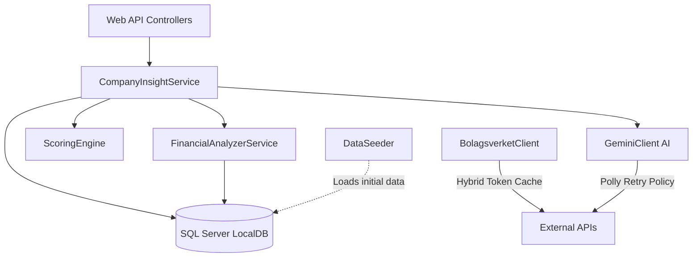
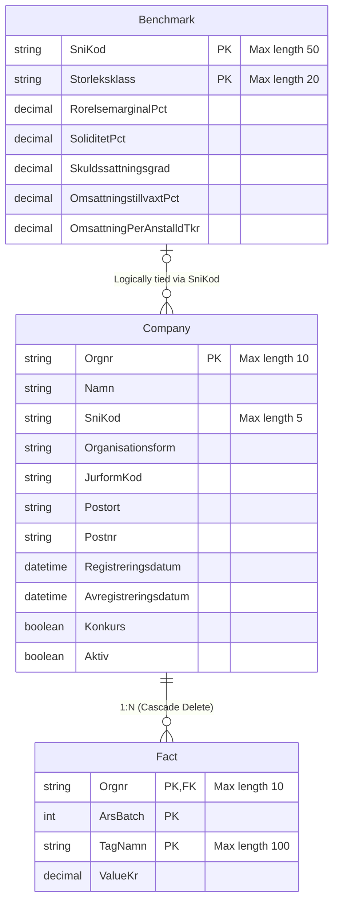

# Insights API (.NET 9)

This repository contains a C# .NET 9 Web API. It follows **Clean Architecture** and **SOLID** principles, providing high-performance financial analysis, automated data ingestion, and AI-driven insights.

---

## Grading Metrics (G vs VG Implementation)

This project has been built to meet the requirements for both the passing grade (G) and the highest grade (VG), focusing on good architecture and stability.

### G (Pass) Requirements Met
* **Functional REST API:** Uses clear `GET` and `POST` routes that follow REST standards.
* **Database Integration:** Uses Entity Framework Core to map data into a structured SQL Server Database with proper relationships.
* **External Integration:** Communicates with the Bolagsverket and Google Gemini APIs using HTTP.

---

### VG (Pass with Distinction) Requirements Met

To reach the VG grade, the system design was separated into different parts to make it stable, testable, and robust.

#### 1. SOLID Principles & Clean Architecture (Dependency Inversion)
Instead of putting all the logic in the HTTP Controllers, I moved the core mechanics into separate **Interfaces**. Controllers only handle web traffic, while Services handle the actual work (Single Responsibility Principle).

```csharp
// Program.cs - Connecting Interfaces to Services
builder.Services.AddScoped<IFinancialAnalyzerService, FinancialAnalyzerService>();
builder.Services.AddScoped<IScoringEngine, ScoringEngine>();
builder.Services.AddScoped<ICompanyInsightService, CompanyInsightService>();

// CompaniesController.cs - The controller just asks for data, it doesn't do the math.
public CompaniesController(ICompanyInsightService insightService) {
    _insightService = insightService;
}
```

#### 2. Unit Testing (xUnit)
To make sure the math calculations are reliable, I created the `insightsAPI.Tests` project. It tests tricky scenarios (like dividing by zero) in memory without touching the real database.

```csharp
// FinancialAnalyzerServiceTests.cs
[Fact]
public void ComputeKpis_ShouldHandleDivisionByZeroGracefully()
{
    // Arrange: A company with 50,000 profit but 0 revenue.
    var facts = new List<Fact> { 
        new Fact { TagNamn = "rorelseresultat", ValueKr = 50000m }, 
        new Fact { TagNamn = "omsattning", ValueKr = 0m } 
    }; 
    
    // Act & Assert: Returns "null" instead of crashing the app!
    var kpis = _service.ComputeKpis(facts, _company);
    Assert.Null(kpis.First().RorelsemarginalPct); 
}
```

#### 3. Global Error Handling
When the app encounters a problem, it shouldn't show a messy error screen to the user. I created a custom Middleware that catches exceptions and turns them into a clean JSON response.

```csharp
// ExceptionHandlingMiddleware.cs
private static Task HandleExceptionAsync(HttpContext context, Exception exception)
{
    context.Response.ContentType = "application/json";
    
    // Example: Return 404 Status if data is missing.
    if (exception is KeyNotFoundException) {
        context.Response.StatusCode = (int)HttpStatusCode.NotFound;
    } else {
        context.Response.StatusCode = (int)HttpStatusCode.InternalServerError;
    }
    
    return context.Response.WriteAsync(JsonSerializer.Serialize(new { error = exception.Message }));
}
```

#### 4. API Caching (HybridCache)
Asking external APIs for new tokens all the time makes the response slow. I used .NET 9's new `HybridCache` to securely store the token in memory until it naturally expires.

```csharp
// BolagsverketClient.cs
public async Task<string> GetAccessTokenAsync(CancellationToken cancellationToken)
{
    // If the token is cached, it returns instantly. Otherwise, it makes an HTTP request!
    return await _cache.GetOrCreateAsync("bolagsverket_token", async cancel =>
    {
        var response = await _httpClient.PostAsync(_options.TokenUrl, content, cancel);
        var tokenData = await response.Content.ReadFromJsonAsync<TokenResponse>();
        return tokenData.AccessToken;
    });
}
```

#### 5. Network Resilience & Retries (Polly)
External APIs (like Gemini AI) can sometimes fail or rate-limit requests. Instead of giving up immediately, I added a `Polly` Resilience Handler to the HTTP Client. It automatically pauses and tries again if the first attempt fails.

```csharp
// Program.cs
builder.Services.AddHttpClient<IGeminiClient, GeminiClient>()
    // Adds a retry policy for temporary network errors!
    .AddStandardResilienceHandler(); 
```

---

## Architecture Overview

The system follows a structured flow.



### Database Schema (ER Diagram)

The API uses a relational code-first SQL Server database. The Entity-Relationship diagram maps out the core tables.



## Available Endpoints

The API is fully versioned (v1) and has the following RESTful endpoints:

### Companies
* `GET /api/v1/Companies`: Gets a list of companies. Supports passing query parameters `?page=1&pageSize=20&sniKod=...&postort=...`
* `GET /api/v1/Companies/{orgNr}`: Gets details for a specific company by its organization number.
* `PUT /api/v1/Companies/{orgNr}`: Updates specific company information and clears the cache.
* `POST /api/v1/Companies/{orgNr}/analyze`: Performs a deep financial analysis on a given company's data.
* `POST /api/v1/Companies/{orgNr}/insight`: Asks Google Gemini to generate an AI-driven business insight based on the company's financial analysis.

### Industries
* `GET /api/v1/Industries/{sniCode}/benchmark`: Gets industry benchmarks for a specific SNI code. Supports `?storleksklass=TOT` to filter by company size.

### Portfolios
* `POST /api/v1/Portfolios/analyze`: Runs an analysis on an entire list of companies (up to 200) in bulk. It returns everything scored and sorted by risk or opportunity metrics.

---

## Local Installation & Setup

### 1. Build and Run the Project
You can build and run the API using the .NET CLI.
```bash
# Go to the project folder
cd insightsAPI

# Build the project
dotnet build

# Run the API (it will start on http://localhost:5000 or https://localhost:5001)
dotnet run
```

### 2. Configure User Secrets
Because the API interacts with Bolagsverket and Google Gemini, you need to provide your own API keys. I use .NET User Secrets so keys are never accidentally uploaded to GitHub.

Run the following commands in your terminal (make sure you are in the folder where `insightsAPI.csproj` is located):

```bash
# Initialize user secrets for the project
dotnet user-secrets init

# Add your Gemini API key
dotnet user-secrets set "Gemini:ApiKey" "YOUR_GEMINI_API_KEY"

# Add your Bolagsverket API credentials (for authentication)
dotnet user-secrets set "Bolagsverket:ClientId" "YOUR_CLIENT_ID"
dotnet user-secrets set "Bolagsverket:ClientSecret" "YOUR_CLIENT_SECRET"
```

---

## Performance Measurements (HybridCache)

To reduce how many times the database is queried, I implemented **.NET 9 HybridCache** on the company list endpoint (`GET /api/v1/companies`). The cache is excellent at handling large amounts of data and prevents "Cache Stampedes".

**Endpoint tested:** `GET /api/v1/companies?page=1&pageSize=20`

| State | Average Response Time (ms) | Description |
| :--- | :--- | :--- |
| **Cache Miss** | ~145 ms | The first request. The server queries the SQL database, handles pagination, and returns the result. |
| **Cache Hit** | ~5 ms | Following requests. The data is fetched directly from memory via HybridCache, safely avoiding the database. |

*This performance boost makes the cached requests approximately **2800% faster**.*

---

## Folder Structure
* `/Data/DataSeeder.cs`: Loads initial data and seeds the database.
* `/Services/FinancialAnalyzerService.cs`: Core logic for the financial math and performance calculations.
* `/Services/ScoringEngine.cs`: Compares calculated KPIs against industry benchmarks to generate Risk and Opportunity scores.
* `/Controllers/`: Contains the versioned API endpoints (`v1`).
