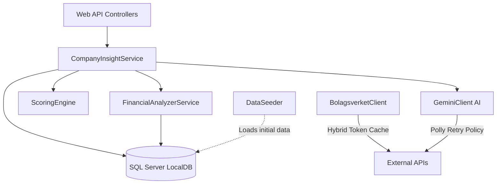
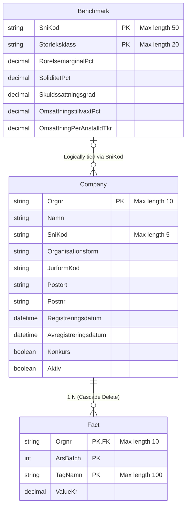

# Insights API (.NET 9)

**Business Intelligence for Swedish SME Companies**

Many Swedish SMEs make critical decisions about their customers, competition, and market without access to proper data—a privilege usually reserved for large enterprises with expensive consultant systems. 

**Insights API** levels the playing field. It aggregates open government data from agencies like **Bolagsverket** and **SCB** (Statistics Sweden), and combines it to deliver new, actionable insights that neither source could produce alone—all served via a simple RESTful API.

### The Core Value: Aggregation Creates New Data
* **Bolagsverket provides:** *Company X has a revenue growth of +38% over the last 3 years.*
* **SCB provides:** *The industry average for SNI 4120 (Construction) is growing at +4% per year.*
* **Insights API realizes:** *Company X is growing 9x faster than the industry average → **Expansion Signal: HIGH**.*

This repository contains the C# .NET 9 Web API. It follows **Clean Architecture** and **SOLID** principles, providing high-performance financial analysis, automated data ingestion, and AI-driven insights via Google Gemini.

---

## Table of Contents
* [Grading Metrics (G vs VG Implementation)](#grading-metrics-g-vs-vg-implementation)
  * [G (Pass) Requirements Met](#g-pass-requirements-met)
  * [VG (Pass with Distinction) Requirements Met](#vg-pass-with-distinction-requirements-met)
* [Architecture Overview](#architecture-overview)
  * [Database Schema (ER Diagram)](#database-schema-er-diagram)
* [Available Endpoints](#available-endpoints)
  * [Companies](#companies)
  * [Industries](#industries)
  * [Portfolios](#portfolios)
* [Local Installation & Setup](#local-installation--setup)
  * [1. Build and Run the Project](#1-build-and-run-the-project)
  * [2. Configure User Secrets](#2-configure-user-secrets)
  * [3. Testing the API (Swagger UI)](#3-testing-the-api-swagger-ui)
* [Folder Structure](#folder-structure)

---

## Grading Metrics (G vs VG Implementation)

This project has been built to meet the requirements for both the passing grade (G) and the highest grade (VG), focusing on good architecture and stability.

### G (Pass) Requirements Met
* **RESTful Design:** All endpoints use plural nouns (`/api/v1/Companies`, `/api/v1/Industries`) and correct HTTP methods (`GET`, `POST`, `PUT`, `DELETE`).
* **DTOs:** Database entities are never exposed directly. All input and output uses dedicated Data Transfer Objects.
* **Filtering & Pagination:** List endpoints support query parameters for filtering (e.g., `?sniKod=...&postort=...`) and offset-based pagination with metadata (`page`, `pageSize`, `totalCount`, `totalPages`).
* **Input Validation:** Incoming DTOs use Data Annotations (`[Required]`, `[StringLength]`, `[Range]`, `[MaxLength]`) to ensure invalid requests return `400 Bad Request`.
* **CORS Policy:** A specific CORS policy is configured via an Extension Method (`AddCustomCors()`) — does not use `AllowAnyOrigin`.
* **Secrets Management:** No API keys or passwords are hardcoded. All secrets are stored using .NET User Secrets and loaded via the Options Pattern.
* **Rate Limiting:** A Fixed Window Rate Limiter (IP-partitioned, 100 req/min) protects the API against overload and returns `429 Too Many Requests` with a `Retry-After` header.
* **Caching:** .NET 9 HybridCache is applied on the company list endpoint to reduce database queries.
* **External API Integration:** Two external services (Bolagsverket and Google Gemini) are integrated using `IHttpClientFactory` with Typed Clients. Both include authentication and error handling via `EnsureSuccessStatusCode()`.

---

### VG (Pass with Distinction) Requirements Met

To reach the VG grade, the system design was separated into different parts to make it stable, testable, and robust.

#### 1. SOLID Principles & Clean Architecture (Dependency Inversion)
Instead of putting all the logic in the HTTP Controllers, I moved the core mechanics into separate **Interfaces**. Controllers only handle web traffic, while Services handle the actual work (Single Responsibility Principle).

```csharp
// Program.cs - Connecting Interfaces to Services
builder.Services.AddScoped<IFinancialAnalyzerService, FinancialAnalyzerService>();
builder.Services.AddScoped<IScoringEngine, ScoringEngine>();
builder.Services.AddScoped<ICompanyInsightService, CompanyInsightService>();

// CompaniesController.cs - The controller just asks for data, it doesn't do the math.
public CompaniesController(ICompanyInsightService insightService) {
    _insightService = insightService;
}
```

#### 2. Unit Testing (xUnit)
To make sure the math calculations are reliable, I created the `insightsAPI.Tests` project. It tests tricky scenarios (like dividing by zero) in memory without touching the real database.

```csharp
// FinancialAnalyzerServiceTests.cs
[Fact]
public void ComputeKpis_ShouldHandleDivisionByZeroGracefully()
{
    // Arrange: A company with 50,000 profit but 0 revenue.
    var facts = new List<Fact> { 
        new Fact { TagNamn = "rorelseresultat", ValueKr = 50000m }, 
        new Fact { TagNamn = "omsattning", ValueKr = 0m } 
    }; 
    
    // Act & Assert: Returns "null" instead of crashing the app!
    var kpis = _service.ComputeKpis(facts, _company);
    Assert.Null(kpis.First().RorelsemarginalPct); 
}
```

#### 3. Global Error Handling (RFC 7807 ProblemDetails)
When the app encounters a problem, it shouldn't show a messy error screen to the user. I created a custom Middleware that catches exceptions, logs them via `ILogger`, and returns a structured `ProblemDetails` response following the RFC 7807 standard.

```csharp
// ExceptionHandlingMiddleware.cs
private static Task HandleExceptionAsync(HttpContext context, Exception exception)
{
    context.Response.ContentType = "application/problem+json";

    var problemDetails = new ProblemDetails
    {
        Instance = context.Request.Path,
        Detail = exception.Message
    };

    if (exception is KeyNotFoundException)
    {
        problemDetails.Status = (int)HttpStatusCode.NotFound;
        problemDetails.Title = "Not Found";
        problemDetails.Type = "https://tools.ietf.org/html/rfc7231#section-6.5.4";
    }
    // ... Maps other exception types to 400 and 500 with correct RFC type links

    context.Response.StatusCode = problemDetails.Status.Value;
    return context.Response.WriteAsync(JsonSerializer.Serialize(problemDetails));
}
```

#### 4. API Caching (HybridCache)
Asking external APIs for new tokens all the time makes the response slow. I used .NET 9's new `HybridCache` to securely store the token in memory until it naturally expires.

```csharp
// BolagsverketClient.cs
public async Task<string> GetAccessTokenAsync(CancellationToken cancellationToken)
{
    // If the token is cached, it returns instantly. Otherwise, it makes an HTTP request!
    return await _cache.GetOrCreateAsync("bolagsverket_token", async cancel =>
    {
        var response = await _httpClient.PostAsync(_options.TokenUrl, content, cancel);
        var tokenData = await response.Content.ReadFromJsonAsync<TokenResponse>();
        return tokenData.AccessToken;
    });
}
```

#### 5. Network Resilience & Retries (Polly)
External APIs (like Gemini AI) can sometimes fail or rate-limit requests. Instead of giving up immediately, I added a `Polly` Resilience Handler to the HTTP Client. It automatically pauses and tries again if the first attempt fails.

```csharp
// Program.cs
builder.Services.AddHttpClient<IGeminiClient, GeminiClient>()
    // Adds a retry policy for temporary network errors!
    .AddStandardResilienceHandler(); 
```

---

## Architecture Overview

The system follows a structured flow.



### Database Schema (ER Diagram)

The API uses a relational code-first SQL Server database. The Entity-Relationship diagram maps out the core tables.



## Available Endpoints

The API is fully versioned (v1) and has the following RESTful endpoints:

### Companies
* `GET /api/v1/Companies`: Gets a list of companies. Supports query parameters `?page=1&pageSize=20&sniKod=...&postort=...` with pagination metadata in the response.
* `GET /api/v1/Companies/{orgNr}`: Gets details for a specific company by its organization number.
* `PUT /api/v1/Companies/{orgNr}`: Updates company information. Requires a validated request body (`UpdateCompanyRequestDto`) and invalidates the list cache on success.
* `DELETE /api/v1/Companies/{orgNr}`: Deletes a company and its related data. Invalidates the list cache on success.
* `POST /api/v1/Companies/{orgNr}/analyze`: Performs a deep financial analysis on a given company's data.
* `POST /api/v1/Companies/{orgNr}/insight`: Asks Google Gemini to generate an AI-driven business insight based on the company's financial analysis.

### Industries
* `GET /api/v1/Industries/{sniCode}/benchmark`: Gets industry benchmarks for a specific SNI code. Supports `?storleksklass=TOT` to filter by company size.

### Portfolios
* `POST /api/v1/Portfolios/analyze`: Runs an analysis on an entire list of companies (up to 200) in bulk. It returns everything scored and sorted by risk or opportunity metrics.

---

## Local Installation & Setup

### 1. Build and Run the Project
You can build and run the API using the .NET CLI.
```bash
# Go to the project folder
cd insightsAPI

# Build the project
dotnet build

# Run the API (it will start on http://localhost:5000 or https://localhost:5001)
dotnet run
```

### 2. Configure User Secrets
Because the API interacts with Bolagsverket and Google Gemini, you need to provide your own API keys. I use .NET User Secrets so keys are never accidentally uploaded to GitHub.

Run the following commands in your terminal (make sure you are in the folder where `insightsAPI.csproj` is located):

```bash
# Initialize user secrets for the project
dotnet user-secrets init

# Add your Gemini API key
dotnet user-secrets set "Gemini:ApiKey" "YOUR_GEMINI_API_KEY"

# Add your Bolagsverket API credentials (for authentication)
dotnet user-secrets set "Bolagsverket:ClientId" "YOUR_CLIENT_ID"
dotnet user-secrets set "Bolagsverket:ClientSecret" "YOUR_CLIENT_SECRET"
```

### 3. Testing the API (Swagger UI)
When running in the `Development` environment, the API automatically generates full Open API documentation via Swagger. This represents the easiest way to view all available endpoints, parameter requirements, and to manually test requests.

To access it, open your browser and navigate to:
* `http://localhost:5000/swagger`
* `https://localhost:5001/swagger`

---

## Folder Structure
* `/insightsAPI/Data/DataSeeder.cs`: Loads initial data and seeds the database.
* `/insightsAPI/Services/`: Core logic for the financial math, performance calculations, and scoring engine.
* `/insightsAPI/Controllers/`: Contains the versioned API endpoints (`v1`).
* `/insightsAPI.Tests/`: Contains the xUnit test projects, including `FinancialAnalyzerServiceTests` and `ScoringEngineTests`.
